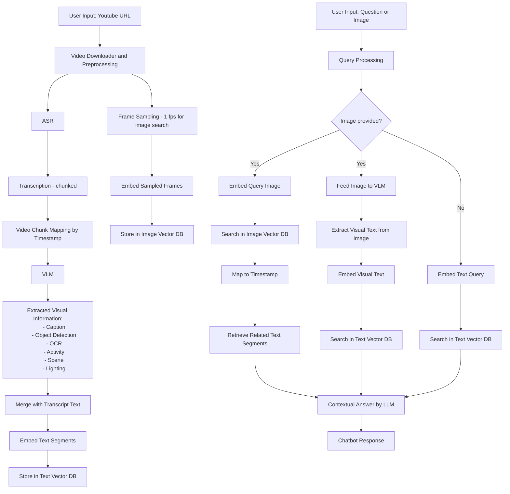

# 🎥 Video Insight Chatbot

A powerful chatbot that allows users to ask questions about the content of a video — whether by uploading a file, providing a YouTube link, or even submitting a screenshot to locate specific moments in the video.

---

## ✨ Features

- 📹 Upload a YouTube URL.
- 🔍 Ask natural language questions about video content (speech, scenes, visuals).
- 🖼️ Submit a screenshot/image and ask it.
- 🧠 Backed by modern multimodal AI techniques (speech + image + text).

---

## 🔄 System Pipeline

## Technologies Used
- Video Downloader: yt-dlp
- Transcription (ASR): Whisper.cpp (don't use when have subtitles in video)
- Image Embedding:
- Video Analysis: SmolVLM2
  - Detail Caption
  - Object Detection
  - Text in image (OCR)
  - Actions or activity
  - Spatial context / scene	
  - Time / lighting context	
- Vector Store: Qdrant
- Contextual Answering: LLM

