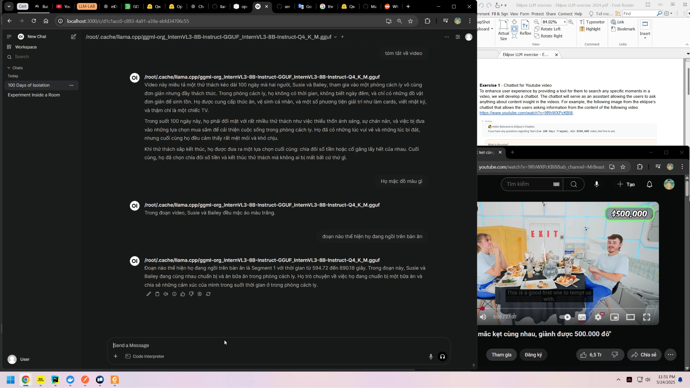
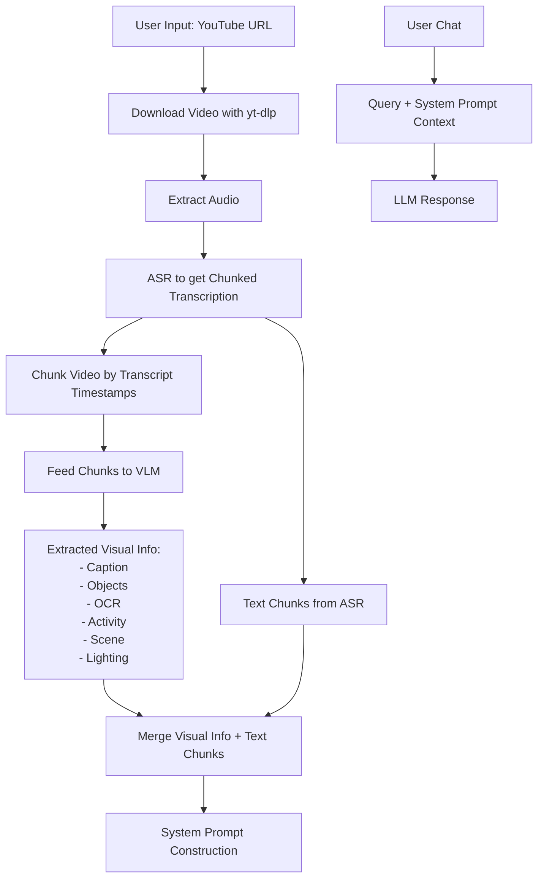

# 🎥 **Video Insight Chatbot**

> *An intelligent chatbot that lets you ask questions about video content — whether by uploading a file, sharing a YouTube link, or even submitting a screenshot to find specific moments.*


---
## 📽 Demo

Click the image below to watch the demo video:

[](https://youtu.be/d9r8VSMw26g)

---


## ✨ **Features**

* 📹 **YouTube URL Support** — Automatically downloads and processes videos.
* 🔍 **Ask Natural Language Questions** — About speech, scenes, visuals, and activities.
* 🧠 **Powered by Multimodal AI** — Combines audio, image, and text understanding.

---

## 🔄 **System Pipeline**



---

## 🛠️ **Technologies Used**

* **Video Download**: [`yt-dlp`](https://github.com/yt-dlp/yt-dlp)
* **Audio Transcription (ASR)**: [`whisper.cpp`](https://github.com/ggerganov/whisper.cpp)
* **VLM**: [`InternVL3-8B`](https://huggingface.co/OpenGVLab/InternVL3-8B-Instruct)

  * Detailed captions
  * Object & activity detection
  * OCR (text in video)
  * Scene and lighting context
* **Chat **: **InternVL3-8B**

---

## 🚀 **Getting Started**

### 🔧 Install `just`

```bash
sudo apt install just
```

### 📦 Install Dependencies & Download Models

```bash
just dependency
just download-model
```

### ▶️ Run the App

```bash
just start

# Waiting for model downloading...
```

### Test
[localhost:3000](http://localhost:3000)

---

## 📬 **Contact**
**Email**: [liemkg1234@gmail.com](mailto:liemkg1234@gmail.com)
